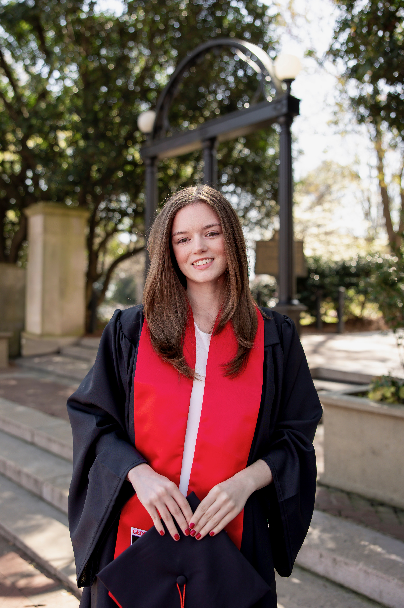
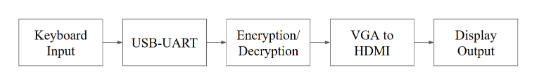
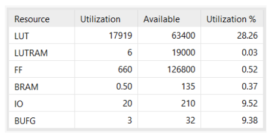

### Professional Summary
My name is Aubrey David, and I am a graduating Computer Systems Engineering student at the University of Georgia with a deep interest in cybersecurity and low-level system design. My technical expertise spans from developing complex logic designs in Verilog to implementing secure mobile and hardware integrations. I thrive at the intersection of hardware and software, with a proven ability to lead technical teams through the full development lifecycle, from initial architectural brainstorming to final system testing. I am currently looking for opportunities to apply my skills in secure system architecture and binary exploitation to solve real-world security challenges.

### Essential Links
* [View My Resume](resume.pdf)
* [View My Transcript](transcript.pdf)
* [Connect on LinkedIn](https://www.linkedin.com/in/aubrey-david/)

### Featured Project: AES Cryptographic Accelerator
"Alphabet Soup" is a high-throughput cryptographic accelerator designed to perform real-time AES (Advanced Encryption Standard) encryption and decryption on an FPGA NEXYS A7 board. The system takes user input via a USB-UART interface, processes 128-bit data blocks through a pipelined AES core, and displays the resulting ciphertext or plaintext on a monitor via VGA.
* [View the Report Here](CSEE4280_FinalReport)

### Contact
* aubreyldavid04@gmail.com
